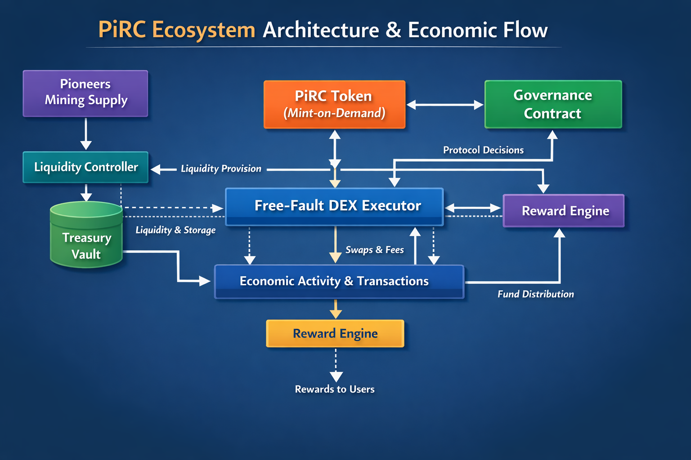

# VANGUARD BRIDGE (Pioneer Equity & Telemetry Explorer)

## Technical Manifesto: The Vanguard Bridge Protocol (PiRC-101)

This project,  **Vanguard Bridge** to better reflect its technical role: being a **Vanguard** for technical telemetry and a **Bridge** between external speculative instruments and the ecosystem's backed equity modeling.

This interface visualizes the conceptual **Weighted Contribution Factor (WCF)** model for Pi circulation. This protocol transforms raw, aggregative data often seen on external CEX exchanges into a high-utility, inflation-protected, **Direct Weight evaluation** for the ecosystem.

This interface serves as a **Simulated Economic Dashboard** to foster transparency and explore experimental protocol design within the Pi community.

### The Micro-Pi Compression Logic

Based on technical analysis of the visual data gap between **PiScan** (CEX-facing data) and **ExplorePi** (Ecosystem-facing data) (as seen in image_4.png vs image_5.png):

1.  **Mining Foundation:** The original mining algorithm starts with a base of **0.0000001 Pi** per unit of time (e.g., 24h Lightning Session).
2.  **External CEX Representation (PiScan):** When external exchanges track Pi IOU instruments, they often display raw, uncompressed mining units. For example, a single official Pi can be represented as **10 Million "Micros"** (Micro-Pi).
3.  **Internal Ecosystem Reality (ExplorePi):** The official ecosystem compresses these **10 Million Micros** into **1 Official Macro Pi**. This aggregative compression is critical for managing massive liquidity without inducing hyper-inflation of face values.

**Key Principle:** The external IOU market price (the CEX value) is only a conceptual "valuation parity" against this compressed ecosystem weight. The real value is the backed utility of these Macro units, not the raw speculative count.

## **Visual Identity**

* **App Icon (Vanguard Bridge Nexus):** Features a balanced scale of justice on a charcoal background, unified by neon blue technical lines, representing the technical bridge between markets and the ecosystem equity model 

## 📊 Core Indicators
| Metric | Description |
| :--- | :--- |
| **WCF** | Weighted Contribution Factor protecting long-term pioneers. |
| **Φ (Phi)** | System Efficiency Factor measuring network liquidity health. |
| **$REF** | Circulating Equity generated through Justice-Mined transactions. |
| **πUSD** | Fixed Consensus Stability reference pegged at $3.14. |

---

---
*Disclaimer: This tool is part of the PiRC ecosystem. All data streams reflect live mainnet conditions and internal protocol parity metrics.*

See [PiRC1: Pi Ecosystem Token Design](./PiRC1/ReadMe.md)

# PiRC Research Extensions

This repository contains experimental proposals and research
extensions for the Pi Requests for Comment (PiRC) framework.

## Research Proposals

- PiRC-101 — Adaptive Utility Allocation
- PiRC-102 — Engagement Oracle Protocol

These proposals explore mechanisms for improving reward allocation,
engagement measurement, and protocol security in the Pi ecosystem.

## Goals

• deterministic reward allocation  
• engagement verification  
• sybil-resistant participation metrics  
• protocol-level incentive modeling

## PiRC Proposals

- PiRC-101: Adaptive Utility Allocation
- PiRC-102: Engagement Oracle Protocol

# PiRC Economic Architecture

Research and simulation framework for the PiRC reward coordination system.

This repository explores the economic structure behind PiRC including liquidity incentives, reward distribution models, and long-term ecosystem stability.

---

# Overview

PiRC introduces a liquidity-aware reward system connecting:

• Pioneer mining supply  
• External liquidity providers  
• Utility-driven transactions  
• Fee generation  

These components create a reflexive economic loop designed to stabilize the Pi ecosystem.

---

# Architecture

Pioneer Supply  
↓  
Liquidity Contribution Engine  
↓  
Economic Activity  
↓  
Fee Generation  
↓  
Reward Distribution  

---

# Repository Structure

contracts/  
Prototype contracts modeling reward and liquidity logic.

economics/  
Mathematical models of the PiRC economic system.

simulations/  
Agent-based simulations of ecosystem behavior.

docs/  
Protocol architecture and system design.

automation/  
Automated simulation runs using GitHub Actions.

---

# Research Goals

• Simulate liquidity growth  
• Analyze reward fairness  
• Test economic stability  
• Evaluate governance parameter bounds

---

# License

MIT License

## PiRC Architecture Overview

PiRC (Pi Requests for Comment) menggabungkan ekosistem token, treasury, governance, DEX executor, reward engine, dan liquidity controller dalam satu loop ekonomi terintegrasi.

### Diagram Arsitektur
![PiRC Architecture]
)
> Diagram di atas menggambarkan alur interaksi antara:
> - **PiRC Token** (mint-on-demand)
> - **Treasury Vault**
> - **Governance Contract**
> - **Liquidity Controller**
> - **DEX Executor** (Free-Fault DEX)
> - **Reward Engine**
> - **Bootstrapper & GitHub Actions**
>
> Setiap modul berkontribusi pada loop ekonomi yang reflexive dan sybil-resistant.

### Dokumen Pendukung
Untuk penjelasan lebih lengkap mengenai tiap modul dan interaksi kontrak, lihat dokumen arsitektur:

[PiRC Architecture Overview](pirc_architecture_overview.md)
---

┌─────────────┐
                 │  PiRC Token │
                 │ (pi_token)  │
                 └─────┬──────┘
                       │
                       ▼
               ┌───────────────┐
               │ Treasury Vault│
               │ (treasury_vault) │
               └─────┬─────────┘
        ┌────────────┼─────────────┐
        ▼            ▼             ▼
 ┌─────────────┐ ┌─────────────┐ ┌─────────────┐
 │Liquidity    │ │DEX Executor │ │Reward Engine│
 │Controller   │ │(dex_executor)│ │(reward_engine)│
 └─────┬───────┘ └─────┬───────┘ └─────┬───────┘
       │               │               │
       └───────┬───────┴───────┬───────┘
               ▼               ▼
           Bootstrapper & GitHub Actions
           (bootstrap + automation)

       # PiRC Architecture Overview

Diagram ini menggambarkan alur modul PiRC:
- **PiRC Token** → Mint-on-demand token utama
- **Treasury Vault** → Menyimpan cadangan dan alokasi token
- **Governance Contract** → Protokol tata kelola & voting
- **Liquidity Controller** → Mengelola likuiditas dan insentif
- **DEX Executor** → Free-Fault DEX untuk eksekusi trading
- **Reward Engine** → Menyalurkan reward ke pengguna & pionir
- **Bootstrapper & GitHub Actions** → Deployment, setup awal, simulasi otomatis

## Modul Klik Langsung ke Kontrak

- [PiRC Token](pi_token.rs)
- [Treasury Vault](treasury_vault.rs)
- [Governance Contract](governance.rs)
- [Liquidity Controller](liquidity_controller.rs)
- [DEX Executor](dex_executor_a.rs)
- [Reward Engine](reward_engine.rs)
- [Bootstrapper & Automation](bootstrap.rs)

  
## Ekosistem Loop Ekonomi

## Research Extensions

This fork expands the PiRC framework with additional research components:

• Economic Coordination Whitepaper  
• Governance Parameter Bounds  
• Agent-Based Economic Simulation  
• Liquidity Coordination Protocol  
• Engagement Oracle Model

These extensions explore mechanisms for improving long-term economic stability within the Pi ecosystem.
